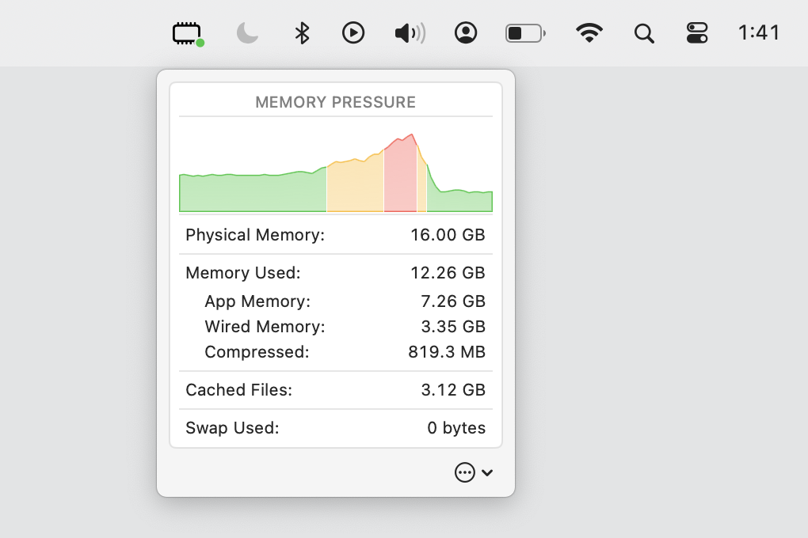

# MemoryActivity

Memory pressure and stats from Activity Monitor — right in your menu bar!

## Installation

Download [MemoryActivity.dmg](https://github.com/skw398/MemoryActivity/releases/download/1.0.5/MemoryActivity.dmg)

- Supported versions:
  - macOS 15 Sequoia
  - macOS 26 Tahoe
  - macOS 27 Golden Gate
- Notarized by Apple
- Protected by the macOS App Sandbox

## Build

1. Open `MemoryActivity.xcodeproj` in Xcode 27.0
1. Run
