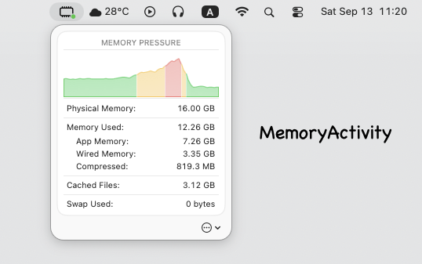

# MemoryActivity

Memory pressure and stats from Activity Monitor — right in your menu bar!

## Installation

Download [MemoryActivity.dmg](https://github.com/skw398/MemoryActivity/releases/download/1.0.3/MemoryActivity.dmg)

- Requires macOS 14 Sonoma or later
- Notarized by Apple
- Protected by the macOS App Sandbox

## Build

1. Open `MemoryActivity.xcodeproj` in Xcode 26.2
1. Run
